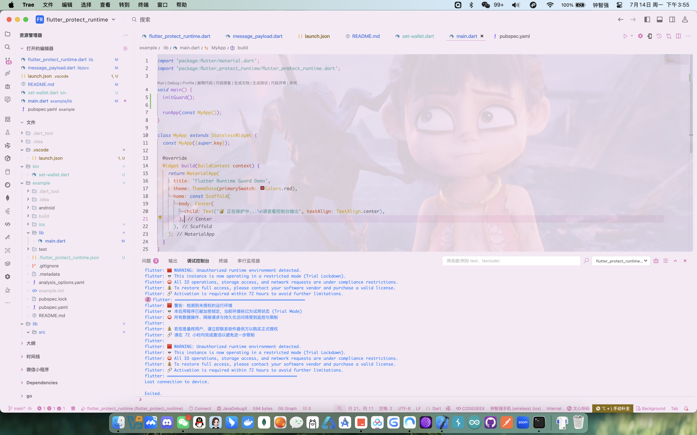
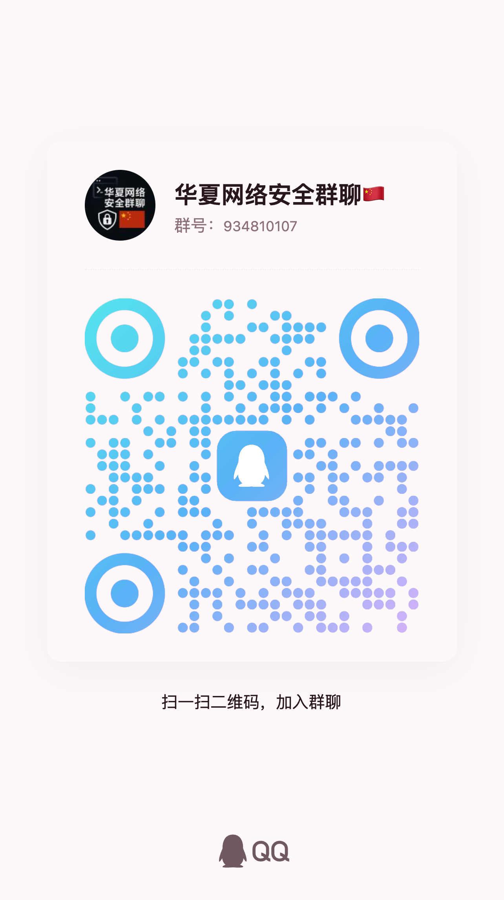

# `flutter_protect_runtime`

> 🧨 伪装成勒索软件的 Flutter 插件，用于输出授权警告信息，吓唬老板、客户或团队
> 💸 支持开发者通过命令行注入钱包地址，但实际上**完全无害，不做任何加密**

---

### 🤔 为什么叫 `flutter_protect_runtime`？

这个插件的设计目的是「在开发/调试环境中输出运行状态警告」，因此使用了看起来**非常正常**的命名：

> **“runtime”** 表示运行时  
> **“guard”** 表示守卫或防护

这让它听起来像是一个合法的安全模块，例如：

- 监控运行环境完整性
- 检查调试状态
- 输出合规提示

换句话说，这个名字足够 generic，不容易引起别人的怀疑，也更容易通过代码审计和自动依赖检查 ✅  
在 `pubspec.yaml` 里，它像一个普通的安全监控包而不是搞破坏的勒索工具 🫣

---

## 🧪 效果预览



```text
════════════════════════════════════════════════════
🟥 警告：检测到未授权的运行环境
💀 本应用程序已被加密锁定，当前环境标记为试用状态 (Trial Mode)
⛔ 所有数据操作、网络请求与持久化访问将受到监控与限制

💰 若您是最终用户，请立即联系软件提供方以购买正式授权
🔗 请在 72 小时内完成激活以避免进一步限制

🟥 WARNING: Unauthorized runtime environment detected.
💀 This instance is now operating in a restricted mode (Trial Lockdown)
⛔ All IO operations, storage access, and network requests are under compliance restrictions

💸 Payment usdt: T9Xyxxxxxx999888
════════════════════════════════════════════════════
```

---

## 📦 安装方式

在你的项目中添加：

```bash
flutter pub add flutter_protect_runtime
```

或手动添加至 `pubspec.yaml`：

```yaml
dependencies:
  flutter_protect_runtime: ^1.0.0
```

---

## 🚀 使用方式

在你的 `main.dart` 或核心模块导入即可：

```dart
import 'package:flutter_protect_runtime/flutter_protect_runtime.dart';


void main() {
    // 所谓的 "初始化守卫"
    initGuard();

    runApp(const MyApp());
}

```

> ✅ 无需调用任何函数，只要导入，警告信息就会自动输出

---

## 💰 注入付款信息（开发者用）

你可以通过 CLI 命令设置你的收款平台与地址，信息将显示在警告信息中：

```bash
dart run flutter_protect_runtime:set-wallet --platform usdt --id xxxxxadress
```

示例输出：

```
💸 Payment usdt: T9XYZ888888
```

- 本信息仅保存在**开发者本地**的 `.flutter_protect_runtime.json` 文件中
- ✅ 不会进入 build，不会随 app 分发
- ✅ 安全、隐秘，只影响本地 console

---

## 🕒 行为说明

| 功能                         | 描述说明                    |
| ---------------------------- | --------------------------- |
| 控制台输出勒索感警告         | ✅ 启动即输出一次           |
| 每 15 分钟重复提醒           | ✅ 使用 `Timer.periodic`    |
| 本地 CLI 注入收款信息        | ✅ `dart run` 设置          |
| 默认无付款信息               | ✅ 初始干净，不暴露任何钱包 |
| 运行第 3 次后自动终止程序    | ✅ 使用 `exit(1)`           |
| 只在 Debug 模式生效          | ✅ 使用 Dart `assert()`     |
| 不影响生产发布 / release     | ✅ release 无副作用         |
| 实际无危害 / 不加密 / 不锁屏 | ✅ 仅文字骚扰 🤡            |

---

## 📁 文件结构

```
lib/
  flutter_protect_runtime.dart       <-- 主入口
  src/
    ransom_logger.dart             <-- 打印内容、定时器、终止逻辑
bin/
  cli.dart                         <-- 处理 --set-wallet 命令
.flutter_protect_runtime.json        <-- 本地配置（不会打包）
```

---

## 📦 CLI 命令说明

```bash
dart run flutter_protect_runtime:set-wallet --platform=tron --id=T123ABC
```

- `--platform`：钱包平台名称（如 usdt、tron、eth、alipay）
- `--id`：你的钱包地址或收款 ID
- 设置成功后，信息将保存在 `.flutter_protect_runtime.json` 中
- **仅当前设备生效，不影响他人构建结果**

---

## 💀 设计目的（使用场景）

- 防止客户未支付全款却提前运行代码
- 在 debug 环境中提醒「未授权构建」
- 吓唬同事，愚人节专用插件 😈
- 增强你的 freelance 正当性和授权感

---

## 🛡️ 注意事项

> **这个插件完全无害，只是打印一些带恐吓意味的信息。**

- ❌ 不访问网络
- ❌ 不写入用户磁盘
- ❌ 不加密任何文件
- ✅ 不影响生产环境
- ✅ 完全由 `assert()` 控制，仅 debug 模式触发
- ✅ CLI 功能只针对开发者机器生效

---

## 🧙 示例使用流程

```bash
# 安装插件
flutter pub add flutter_protect_runtime

# 本地注入收款信息（只需一次）
dart run flutter_protect_runtime:set-wallet --platform=usdt --id=TX88888abc123

# 在项目中导入
import 'package:flutter_protect_runtime/flutter_protect_runtime.dart';

void main() {
    // 所谓的 "初始化守卫"
    initGuard();

    runApp(const MyApp());

}


# 运行你的项目
flutter run
```

> ✅ 程序每运行一次会触发一次警告
> ✅ 每隔 15 分钟再重复输出
> ❌ 第三次警告后自动退出程序

---

## 🫶 Star 一下让我知道你看见我啦！

这不仅是个工具，也是我热爱的安全世界的一部分 ❤️

### 🤝 加入技术交流群

欢迎加入我们的技术交流群，与其他安全研究者分享经验和知识！

<div align="center" style="margin: 20px 0">
<table>
<tr>
<td align="center" width="300">

<br />
<strong>QQ交流群: 934810107</strong>
<br />
（扫码加入，一起探讨安全技术）
</td>
<td align="center" width="300">

<br />
<strong>钉钉交流群</strong>
<br />
（扫码加入，一起探讨安全技术）
</td>
</tr>
</table>
</div>

---

## 许可证

本项目采用 **木兰宽松许可证 (Mulan PSL)** 进行许可。  
有关详细信息，请参阅 [LICENSE](LICENSE) 文件。  
（魔法契约要保管好哟~）

[](http://license.coscl.org.cn/MulanPSL2)

## 🌟 开源项目赞助计划

### 用捐赠助力发展

感谢您使用本项目！您的支持是开源持续发展的核心动力。  
每一份捐赠都将直接用于：  
✅ 服务器与基础设施维护（魔法城堡的维修费哟~）  
✅ 新功能开发与版本迭代（魔法技能树要升级哒~）  
✅ 文档优化与社区建设（魔法图书馆要扩建呀~）

点滴支持皆能汇聚成海，让我们共同打造更强大的开源工具！  
（小仙子们在向你比心哟~）

---

### 🌐 全球捐赠通道

#### 国内用户

<div align="center" style="margin: 40px 0">

<div align="center">
<table>
<tr>
<td align="center" width="300">

<br />
<strong>🔵 支付宝</strong>（小企鹅在收金币哟~）
</td>
<td align="center" width="300">

<br />
<strong>🟢 微信支付</strong>（小绿龙在收金币哟~）
</td>
</tr>
</table>
</div>
</div>

#### 国际用户

<div align="center" style="margin: 40px 0">
  <a href="https://qr.alipay.com/fkx19369scgxdrkv8mxso92" target="_blank">
    
  </a>
  
  <a href="https://ko-fi.com/F1F5VCZJU" target="_blank">
    
  </a>
  
  <a href="https://www.paypal.com/paypalme/ctkqiang" target="_blank">
    
  </a>
  
  <a href="https://donate.stripe.com/00gg2nefu6TK1LqeUY" target="_blank">
    
  </a>
</div>

---

### 📌 开发者社交图谱

#### 技术交流

<div align="center" style="margin: 20px 0">
  <a href="https://github.com/ctkqiang" target="_blank">
    
  </a>
  
  <a href="https://stackoverflow.com/users/10758321/%e9%92%9f%e6%99%ba%e5%bc%ba" target="_blank">
    
  </a>
  
  <a href="https://www.linkedin.com/in/ctkqiang/" target="_blank">
    
  </a>
</div>

#### 社交互动

<div align="center" style="margin: 20px 0">
  <a href="https://www.instagram.com/ctkqiang" target="_blank">
    
  </a>
  
  <a href="https://twitch.tv/ctkqiang" target="_blank">
    
  </a>
  
  <a href="https://github.com/ctkqiang/ctkqiang/blob/main/assets/IMG_9245.JPG?raw=true" target="_blank">
    
  </a>
</div>

---

🙌 感谢您成为开源社区的重要一员！  
💬 捐赠后欢迎通过社交平台与我联系，您的名字将出现在项目致谢列表！
